# GCA-ROM 

GCA-ROM is a library which implements graph convolutional autoencoder architecture as a nonlinear model order reduction strategy.

## Installation

GCA-ROM requires `pytorch`, `pyg`, `matplotlib`, `scipy` and `h5py`. 
They can be easily installed via `pip` or `conda`.

[](https://github.com/fpichi/gca-rom/tree/main/notebook)

**In the notebook folder, one can find the `*.ipynb` files corresponding to the tutorials to run the models in Google Colab without installing the package.**

#### **MacOS**
The latest version of `pyg` is currently not available on `conda`. The required dependencies, exported in *utils/gca_rom.yml*, can be automatically installed in a new environment via  

```bash
conda env create -f gca_rom.yml
```

#### **Linux**

```bash
conda create -n 'gca_rom' python=3.10
conda activate gca_rom
conda install pytorch -c pytorch 
conda install pyg -c pyg
conda install matplotlib pandas scipy jupyter h5py
```

The official distribution is on GitHub, and you can clone the repository using

```bash
git clone git@github.com:fpichi/gca-rom.git
```

## Summary of GCA-ROM Features

### - OFFLINE PHASE
<!-- 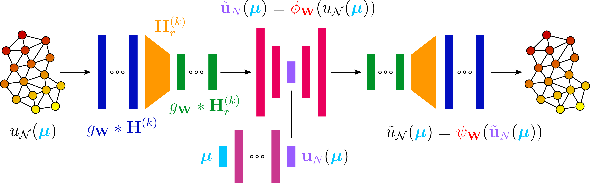 -->
<p align="center">

</p>

### - ONLINE PHASE
<!-- 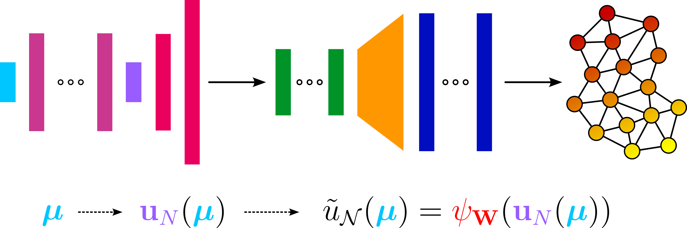 -->
<p align="center">

</p>
The proposed modular architecture, namely Graph Convolutional Autoencoder for Reduced Order Modelling (GCA-ROM), subsequently exploits:
<ol>
<li> a graph-based layer to express an unstructured dataset;</li>
<li> an encoder module compressing the information through:<ol>
<li> spatial convolutional layers based on MoNet [57] to identify patterns between geometrically close regions;</li>
<li> skip-connection operation, to keep track of the original information and help the learning procedure;</li>
<li> a pooling operation, to down-sample the data to obtain smaller networks;</li></ol></li>
<li> a bottleneck, connected to the encoder by means of a dense layer, which contains the latent
behavior in a vector;</li>
<li> a decoder module, recovering the original data by applying the same operations as in the encoder, but in reverse order.</li>
</ol>

## Tutorials

The nonlinear ROM methodology has been tested on 10 different benchmarks, including:
* scalar/vector and linear/nonlinear equations (*01_poisson.py*)
* advection-dominated regime (*02_advection.py*)
* physical and geometrical parametrizations (*03_graetz.py*)
* bifurcating phenomena (*04_navier_stokes_vx.py*, *05_navier_stokes_vy.py*, *06_navier_stokes_p.py*)
* time-dependent models (*07_diffusion.py*, *08_poiseuille.py*)
* a 3D elastic problem (*09_elasticity.py*)
* high-dimensional parametric applications (*10_stokes.py*)

To run a benchmark, navigate to the tutorial folder and run the corresponding *file.py*. If available, a GUI will open with preset values for the hyperparameter configuration of the network. Once the window is closed, the code starts the training phase, unless a trained model with the same configuration already exists. 

<p align="center">
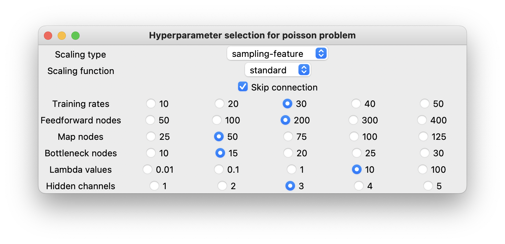</p>

After the GCA-ROM is evaluated, many plots are automatically generated, ranging from training losses, latent evolution, relative errors, solution and error fields
Below are some snaphots of the approximated solutions for the available becnhamrks:

<p align="center">
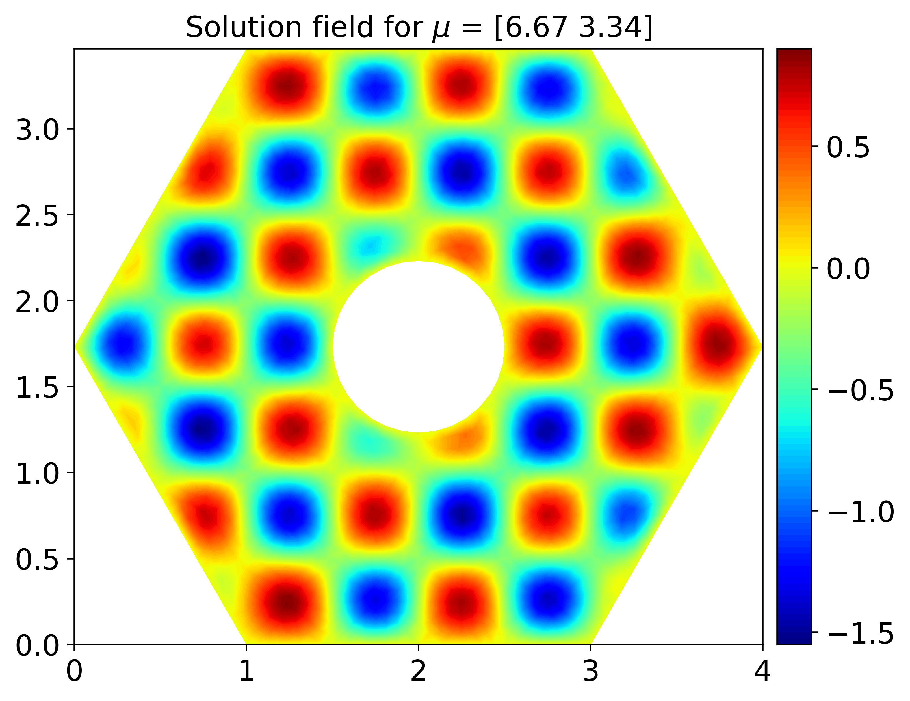
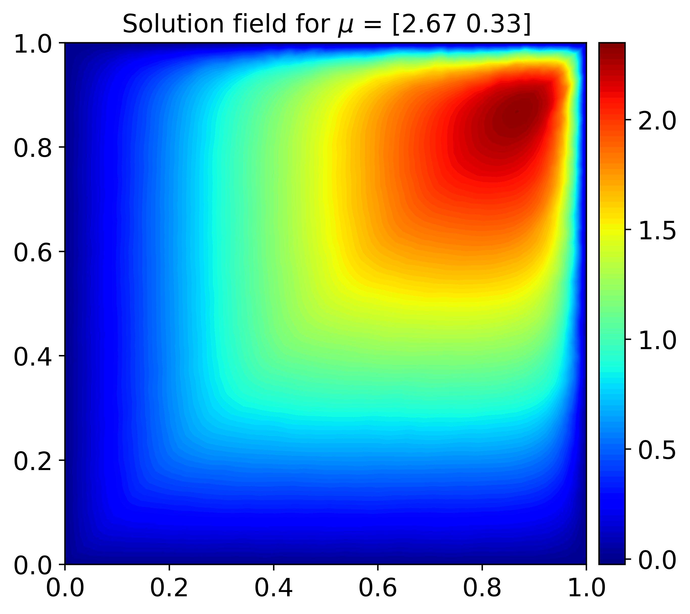
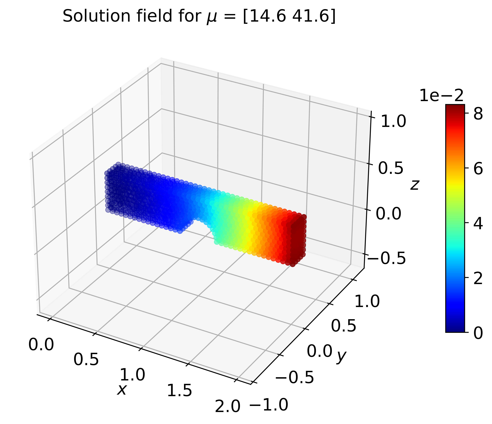
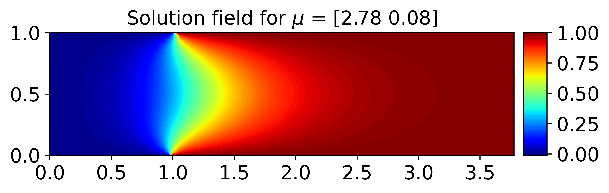
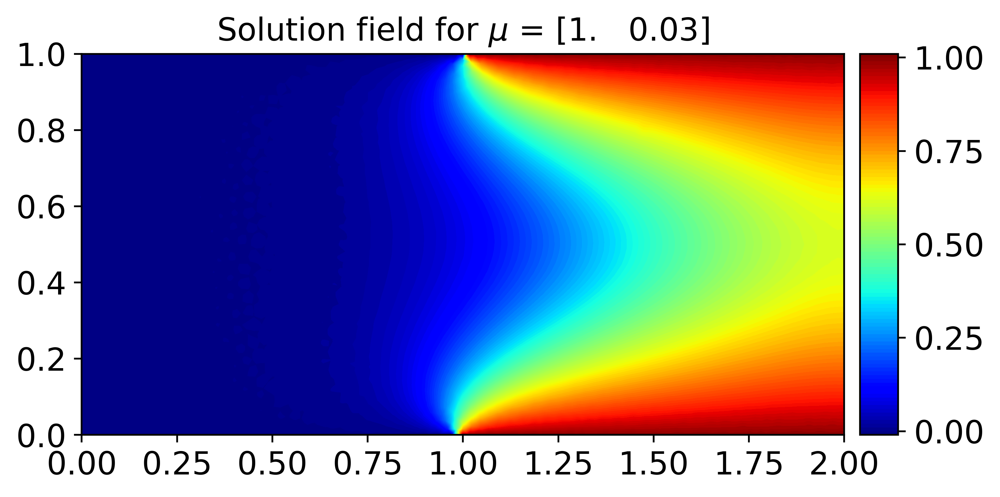
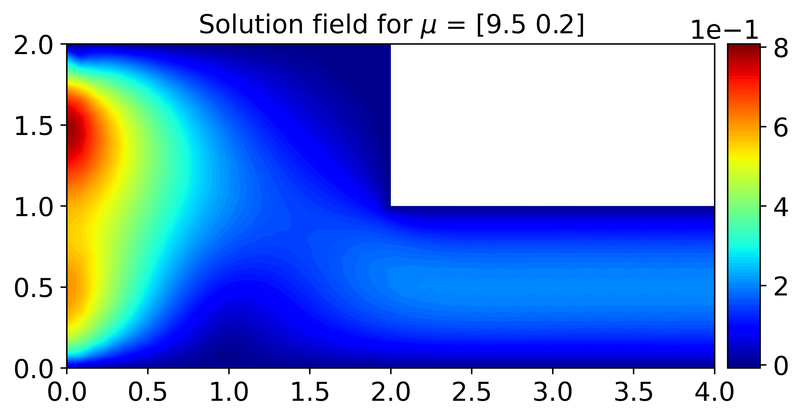
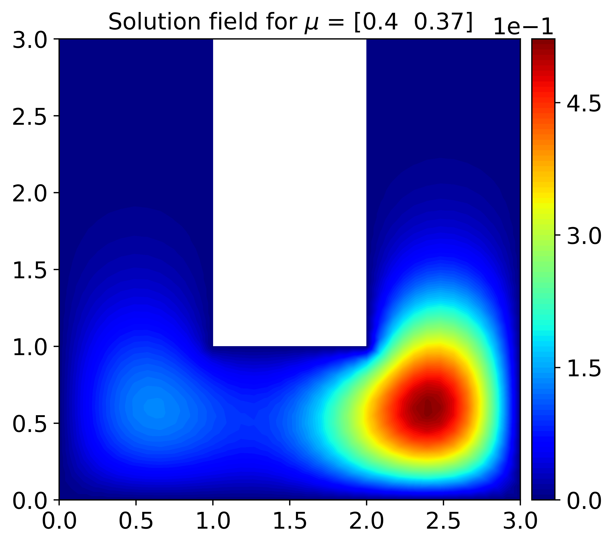
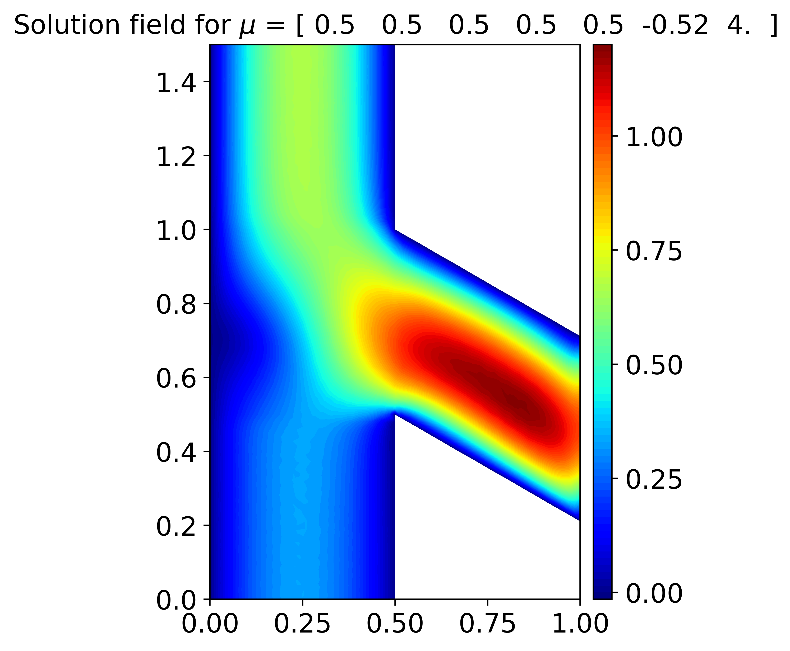
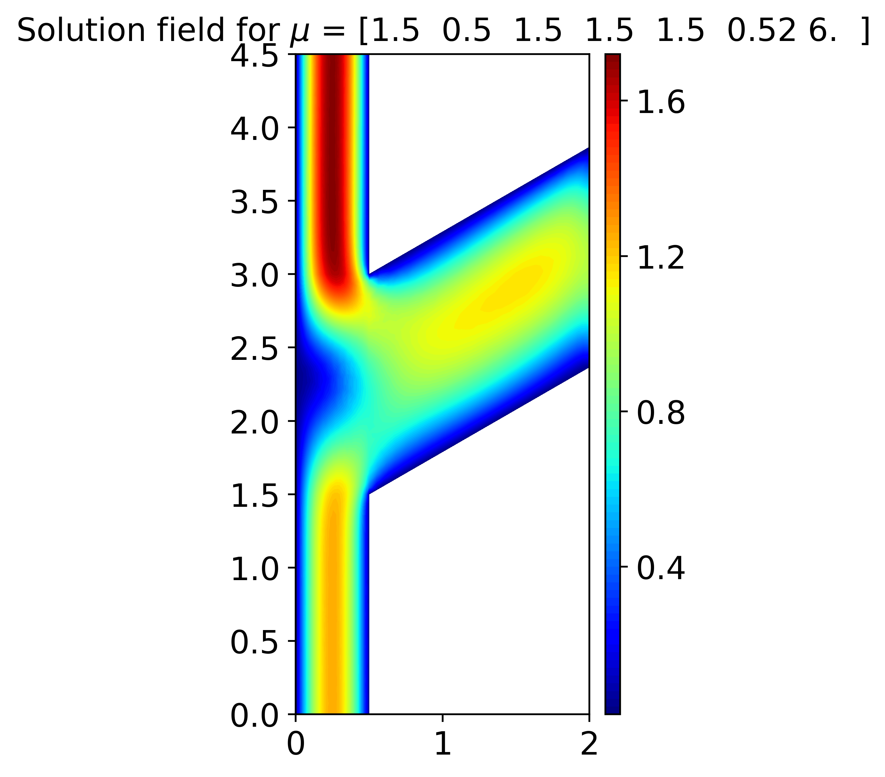
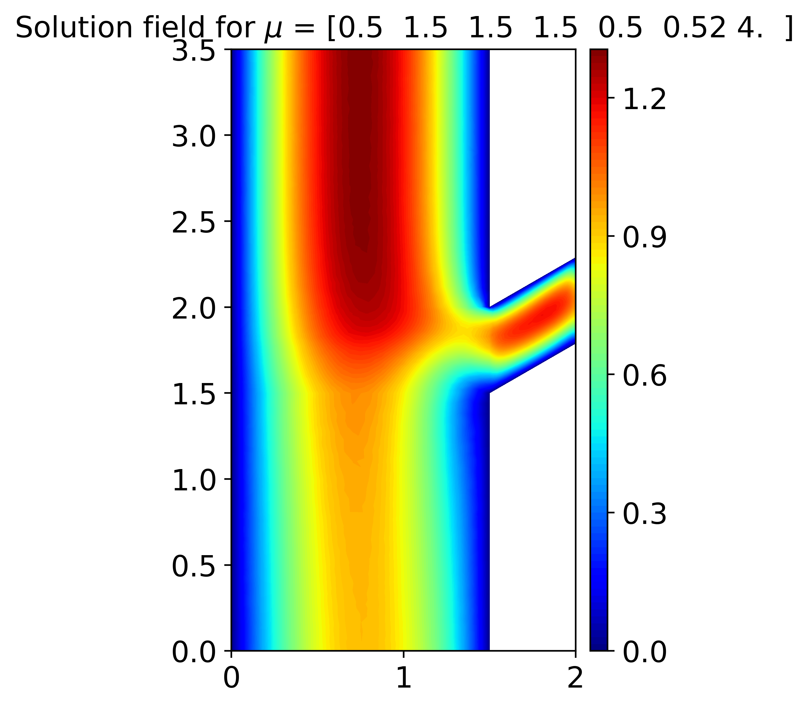
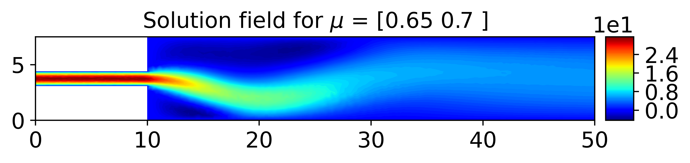
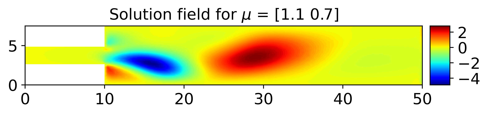
</p>


## Cite GCA-ROM

[1] Pichi, F., Moya, B. and Hesthaven, J.S. (2023) ‘A graph convolutional autoencoder approach to model order reduction for parametrized PDEs’. Available at: [arXiv](https://arxiv.org/abs/2305.08573).

If you use GCA-ROM for academic research, you are encouraged to cite the paper using:


```tex
@misc{PichiGraphConvolutionalAutoencoder2023,
  title = {A Graph Convolutional Autoencoder Approach to Model Order Reduction for Parametrized {{PDEs}}},
  author = {Pichi, Federico and Moya, Beatriz and Hesthaven, Jan S.},
  year = {2023},
  number = {arXiv:2305.08573},
  eprint = {2305.08573},
  primaryclass = {cs, math},
  publisher = {{arXiv}},
  doi = {10.48550/arXiv.2305.08573},
  archiveprefix = {arxiv}
}
```

## Authors and contributors
- Federico Pichi (federico.pichi@epfl.ch)
- Beatriz Moya García (beatriz.moya@cnrsatcreate.sg)

in collaboration with the MCSS group at EPFL of Prof. Jan S. Hesthaven.

With contributions from:

- Francesco Pettenon (francesco.pettenon@epfl.ch)

<a href="https://github.com/fpichi/gca-rom/graphs/contributors">
  
</a>

Made with [contrib.rocks](https://contrib.rocks).
