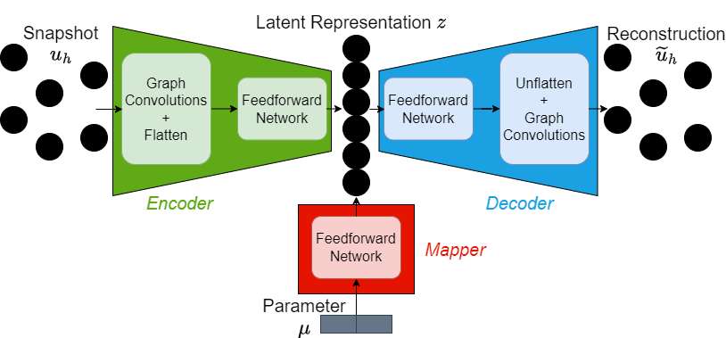
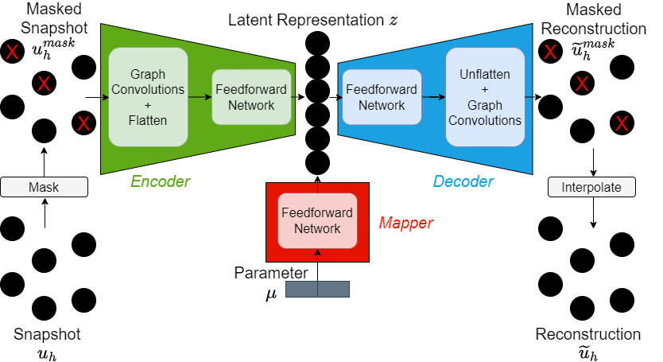
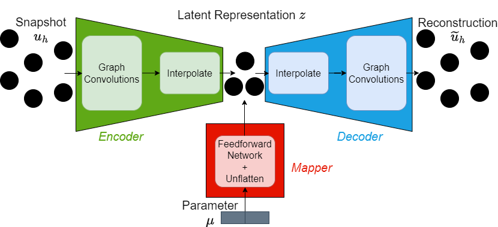
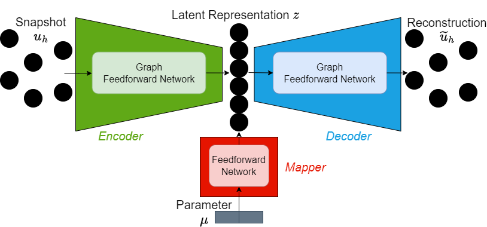

# Pooling (towards multifidelity MOR)

GCA-ROM is capable of compressing graphical information into a condensed latent representation, thus in some sense making it a means of graph pooling and unpooling. However, GCA-ROM is only capable of being trained on a single graph. We show how to extend the architecture to remove this limitation, thereby moving towards multifidelity model order reduction.

We provide three notebooks showing three different extensions, namely:
- `masking.ipynb`
- `gbm.ipynb`
- `gfn.ipynb`

## Overview of standard GCA-ROM

GCA-ROM compresses information by using graph convolutions, then flattening and applying standard feedforward networks.

This requirement of flattening the representation and using a feedforward network means it is impossible to use GCA-ROM on two different graphs.

## Masking

In the [GCA-ROM paper](https://www.sciencedirect.com/science/article/pii/S0021999124000111), initial experiments towards graph pooling and unpooling were already presented via masking.

This approach generally achieves worse performances but reduces the number of parameters. This approach could technically allow the architecture to be used on multiple graphs, provided the masked graph was always the same. However, it is not a true multifidelity method.

## Graph Bottleneck Method (GBM)

The fundamental limitation of the masking approach and GCA-ROM is the presence of the feedforward layer, which requires fixed-size inputs (and therefore fixed graphs). GBM replaces the feedforward layers in the encoder and decoder with interpolation layers, thereby also changing the latent representation from a vector to a graph. The graph upon which to interpolate is a network hyperparameter upon which the performance depends heavily.

GBM generally results in worse performances but achieves a large reduction in the number of model parameters. It is a true multifidelity approach capable of being used on any graph.

## Graph Feedforward Network (GFN)

GFN is described fully in the [GFN paper](https://arxiv.org/pdf/2406.03569), with code on the [GFN github](https://github.com/Oisin-M/GFN). It provides a means of generalising feedforward networks for graphical data. Therefore, one can simply replace the feedforward networks in GCA-ROM with GFNs (and remove the convolutions for simplicity).

GFN achieves comparable results to GCA-ROM on single fidelity data, is computationally cheaper, and can be used on any graphs.

## Summary

| Model | Performance (rel. GCA-ROM) | Model Parameters (rel. GCA-ROM) | Speed (rel. GCA-ROM) | Multifidelity |
| --- | --- | --- | --- | --- |
| Masking | Worse | Fewer | Faster | No |
| GBM | Worse | Far Fewer | Faster | Yes |
| GFN | Same | Same | Far Faster | Yes |